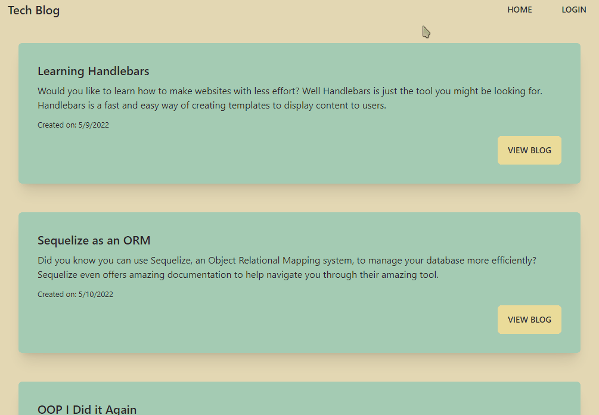
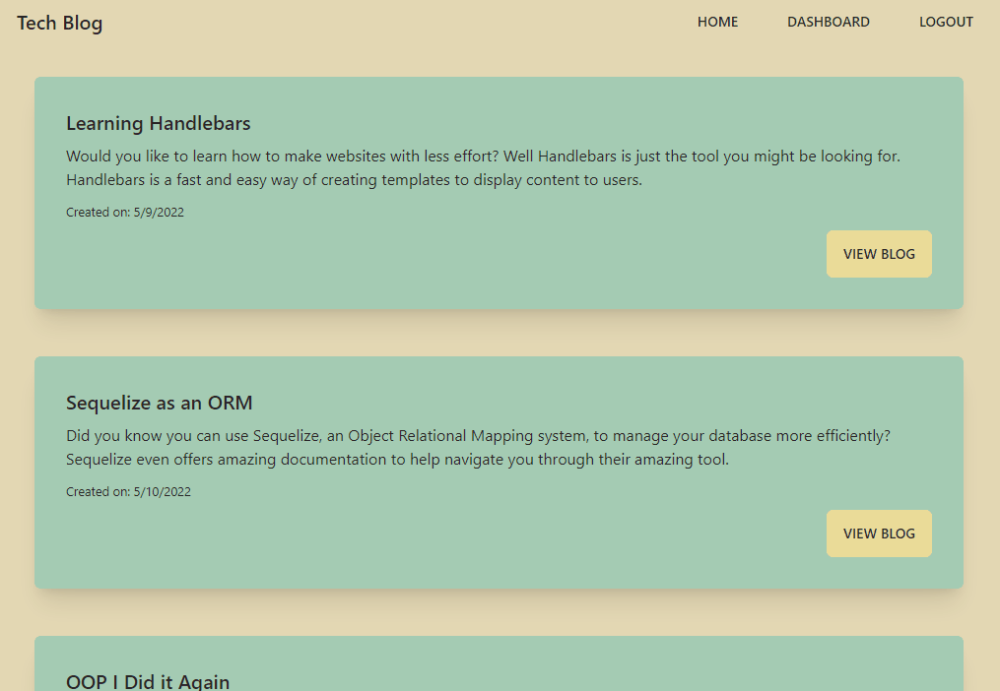

# **Tech Blog**
 

## **Description**
This is a CMS-style blog where developers can publish their blog posts and comment on other developers' posts as well. This site uses Handlebars.js as a templating language.

## **Table of Contents**
1. [Usage](#usage)
2. [Technologies](#technologies)
3. [Credits](#credits)
4. [License](#license)

## **Usage**
The best way to use this web app is by visiting the deployed site <a href="https://joeys-tech-blog.herokuapp.com/" target="_blank">here</a>.

If you are visiting the site for the first time you should sign up. There are some functionalities that you cannot access without an account (such as commenting and creating blog posts). If you already have an account you should log in when you visit the site.

Once logged in, you can navigate to your dashboard to see all the blog posts you have created. You can create new blog posts by clicking the `New Post` button near the bottom of the page.

You can also edit or update your blog post after creating it by viewing your own post and clicking the corresponding buttons.

Users can also delete their own posts. Other than that, you are also able to comment on blog posts!

## **Technologies**
The technologies used in this application are as follows:
* [Handlebars](https://handlebarsjs.com/)
* [Sequelize](https://sequelize.org/)
* [Node.js](https://nodejs.org/en/)
* [MySQL](https://www.mysql.com/)
* [Express.js](https://expressjs.com/)
* [bcrypt](https://www.npmjs.com/package/bcrypt)
* [dotenv](https://www.npmjs.com/package/dotenv)

## **Credits**
This application was built by [coderbennett](https://github.com/coderbennett).

## **License**
This application is under the Apache 2.0 license. Please view the [LICENSE](LICENSE.txt) document for more information.